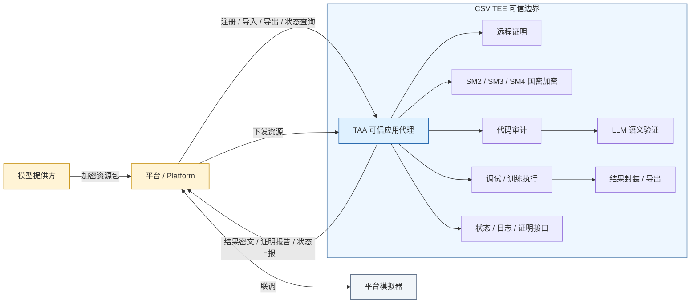

# Trusted Application Agent

TAA（Trusted Application Agent）是运行在 Hygon CSV TEE 环境中的可信应用代理，也是本项目的**密态计算执行框架**：它把模型代码、测试数据、训练数据和结果都放到可信边界内完成处理，通过远程证明、国密加解密、代码审计和结果封装，保证“资源可下发、计算在密态、结果可回传”。

## 一句话定位

- **面向对象**：平台、模型提供方、训练执行环境
- **核心目标**：在 TEE 内完成可信导入、审计、训练、导出和证明，同时保护数据提供方和模型提供方的机密性与权益
- **安全基础**：CSV 远程证明 + SM2/SM3/SM4 国密算法 + 本地代码审计
- **框架定位**：一套可落地的**密态计算闭环框架**

## 框架能力

TAA 以“证明身份、接收资源、审计执行、封装结果、回传状态”为主线，形成一个完整的密态计算链路：



1. **启动即证明**：生成 SM2 密钥对，构造 USERDATA，调用 attestation helper 获取远程证明报告。
2. **注册即绑定**：将 TAA 公钥、证明报告和证明字段上报平台，完成容器身份与 TEE 硬件绑定。
3. **资源密态流转**：平台通过 HTTP 下发加密资源，TAA 在 TEE 内下载、解密、解包和落盘。
4. **审计后执行**：模型代码导入时执行静态扫描，并可启用本地 LLM 语义验证，降低误报。
5. **结果密态导出**：训练结果支持明文或 SM2 信封加密导出，平台侧只拿到可控密文。
6. **状态可观测**：提供 health、status、logs、getAttestation 等接口，便于平台追踪生命周期。

## 目录结构

```text
.
├── cmd/                              # 可执行程序入口（Thin Entrypoint）
│   ├── taa/                          # TAA 主服务入口 (main.go)
│   └── platform-mock/                # 平台模拟器入口 (main.go)
├── internal/                         # 内部私有代码
│   ├── app/                          # 应用启动编排层
│   │   ├── taa/                      # TAA 启动编排、注册与 HTTP 服务组装
│   │   └── mock/                     # 平台模拟器服务与嵌入控制台
│   ├── controller/                   # HTTP 路由、资源处理、结果上报、平台交互
│   │   ├── route.go                  # 路由注册、状态管理、导入/导出/证明接口
│   │   ├── register.go               # 启动注册平台
│   │   ├── report.go                 # 训练/模型导入结果上报
│   │   └── platform_client.go        # 平台地址与共享 HTTP 客户端
│   ├── attestation/                  # 远程证明报告生成与字段提取
│   └── codeaudit/                    # 代码安全审计：静态扫描 + LLM 验证
├── crypto/                           # 国密加解密与证书/密钥工具
├── attestation/                      # CSV 证明 helper 与相关二进制工具
├── docs/                             # 设计与接口文档
├── deploy/manifest/docker/Dockerfile # Docker 镜像构建文件
├── Makefile                          # 构建、运行、镜像命令
└── go.mod                            # Go 模块定义
```

## 核心架构

### 1. 可信边界

TAA 运行在 CSV TEE 中，可信边界内完成：

- SM2 密钥生成
- attestation 生成与验证
- 资源解密与解包
- 模型代码审计
- 训练执行与结果封装
- 结果加密导出

### 2. 密态计算链路

```text
平台 → TAA 注册
     → 平台下发加密资源
     → TAA 在 TEE 内解密/审计/执行
     → TAA 生成结果并重新加密
     → 平台接收结果与状态
```

### 3. 安全控制点

| 控制点 | 作用 |
| --- | --- |
| 远程证明 | 证明 TAA 运行在预期 TEE 环境中 |
| USERDATA 绑定 | 将 TAA 公钥与证明报告绑定 |
| 国密信封加密 | 保证资源和结果在传输/导出时不可明文暴露 |
| 代码审计 | 降低模型代码中的风险行为 |
| LLM 语义验证 | 对可疑发现做二次确认，减少误报 |
| 结果检查 | 导出前检查明文泄露风险 |
| 结构化日志 | 便于平台和运维侧追踪阶段状态 |

## 主要功能

### 1. 启动注册

TAA 启动后会：

- 生成随机 SM2 公私钥对
- 构造 USERDATA = `taaPublicKey.X || taaPublicKey.Y`
- 调用 `attestation/get-attestation` 生成远程证明报告
- 主动向平台调用注册接口

注册请求包含：

- `dockerId`
- `attestation`（Base64 编码的证明报告）
- `taaPublicKey`
- `attestationValues`
- `timestamp`
- `verifiedPass`
- `authInfo = null`

### 2. 资源导入

支持导入模型资源、测试数据和训练数据：

- 下载资源到临时文件
- 校验资源大小上限
- 在 TEE 内解密封装密文
- 解压归档文件
- 根据阶段进入后续处理流程

### 3. 模型导入审计

当导入模型代码时，TAA 会执行：

- Python 静态扫描
- 安全规则匹配
- 可选 LLM 语义验证
- 生成审计报告并上报平台

这部分是本项目“密态计算框架”的重点：**代码不是直接执行，而是在可信环境中先审计、再执行**。

### 4. 训练与结果上报

资源处理完成后，TAA 会：

- 执行调试/训练脚本
- 生成训练结果报告
- 通过 `/v1/taa/reportRes` 异步上报平台

### 5. 结果导出

导出结果时：

- phase 1 / 2：可返回明文或按请求公钥加密
- phase 3：必须使用阶段 1 保存的公钥进行加密导出
- 响应使用 `Content-Disposition` 返回文件流
- 加密格式为 `WrappedKey || Ciphertext`

### 6. 证明与观测

TAA 还提供：

- `/v1/taa/getAttestation`：重新生成证明报告
- `/v1/taa/health`：健康检查
- `/v1/taa/status`：完整状态查询
- `/v1/taa/logs`：结构化日志查询
- `/v1/taa/switch`：阶段切换
- `/v1/taa/getResourceInfo`：对资源包做信息分析

## 接口总览

> 说明：当前实现中这些接口均通过 `POST` 提供。

| 接口 | 作用 |
| --- | --- |
| `/v1/taa/register` | 启动后向平台注册 |
| `/v1/taa/reportRes` | 上报训练/调试结果 |
| `/v1/taa/import` | 导入资源 |
| `/v1/taa/importModel` | 导入模型资源 |
| `/v1/taa/getResourceInfo` | 分析资源包信息 |
| `/v1/taa/switch` | 切换阶段 |
| `/v1/taa/export` | 导出结果 |
| `/v1/taa/getAttestation` | 获取最新证明报告 |
| `/v1/taa/logs` | 查询结构化日志 |
| `/v1/taa/status` | 查询完整状态 |
| `/v1/taa/health` | 健康检查 |

## 运行配置

TAA 从工作目录下的 `taa-config.json` 读取启动配置，不再通过命令行参数传入监听地址、资源目录或代码审计配置。

示例配置：

```json
{
  "addr": ":6001",
  "platformIP": "127.0.0.1:8080",
  "dockerID": "127.0.0.1",
  "contract": "",
  "securityScan": true,
  "modelDir": "/opt/taa/models",
  "resultCheck": true,
  "dataDir": "/opt/taa/data",
  "resultDir": "/opt/taa/results",
  "llm": {
    "enabled": true,
    "endpoint": "http://127.0.0.1:11434",
    "model": "qwen2.5-coder:0.5b",
    "policy": "assist",
    "failClosed": true,
    "dir": ""
  }
}
```

配置文件字段：

| 字段 | 默认值 | 说明 |
| --- | --- | --- |
| `addr` | `:6001` | HTTP 监听地址 |
| `platformIP` | 环境变量 `PLATFORM_IP` | 平台地址；配置文件缺省时读取环境变量 |
| `dockerID` | 环境变量 `DOCKER_ID` | 容器 ID；配置文件缺省时读取环境变量 |
| `contract` | 环境变量 `CONTRACT` | 合约 ID；配置文件缺省时读取环境变量 |
| `securityScan` | `true` | 启用模型代码安全扫描 |
| `modelDir` | `/opt/taa/models` | 模型代码目录 |
| `resultCheck` | `true` | 启用结果泄露检查 |
| `dataDir` | `/opt/taa/data` | 数据目录 |
| `resultDir` | `/opt/taa/results` | 结果目录 |
| `llm.enabled` | `true` | 启用 LLM 语义验证 |
| `llm.endpoint` | `http://127.0.0.1:11434` | LLM 服务地址 |
| `llm.model` | `qwen2.5-coder:0.5b` | LLM 模型名 |
| `llm.policy` | `assist` | LLM 策略 |
| `llm.failClosed` | `true` | LLM 不可用时是否失败关闭 |
| `llm.dir` | 空 | Ollama / Qwen 离线包目录；为空时尝试默认部署目录 |

正式非 debug 部署生成的配置文件不写 `platformIP`、`dockerID`、`contract`，由运行环境注入 `PLATFORM_IP`、`DOCKER_ID`（`CONTRACT` 为可选预留）。

仓库提供三类配置模板：

- `configs/taa-local.json`：本地联调模板，包含本地平台地址和本地运行目录。
- `configs/taa-debug.json`：debug 容器模板，包含平台地址、容器标识和 `/root/taadebug` 工作目录。
- `configs/taa-production.json`：正式部署模板，不包含 `platformIP`、`dockerID`、`contract`，用于从环境变量读取运行身份。

## 本地运行

### 1. 启动平台模拟器

```sh
make platform-mock
```

访问：

```text
http://127.0.0.1:8080
```

### 2. 启动 TAA

```sh
cp configs/taa-local.json taa-config.json
make run
```

也可以手动编译运行：

```sh
make taa
./bin/taa
```

### 3. 部署场景配置

`deploy.sh` 会按部署场景生成并打包 `taa-config.json`：

- local：生成本地容器化测试配置，TAA 与 Qwen 运行在本地 Docker 容器（taa-env-slim-v2），platform-mock 运行在宿主机。
- debug：生成 debug 容器配置，包含平台地址、容器标识和 debug 工作目录。
- 正式非 debug：生成正式容器配置，但不包含 `platformIP`、`dockerID`、`contract`，这些字段从运行环境变量读取。

## 密态计算流程

```text
1. 平台分发加密资源
2. TAA 在 TEE 内下载并解密
3. 模型代码进入审计流程
4. 审计通过后执行训练/调试脚本
5. 生成结果并在 TEE 内封装
6. 平台通过导出接口获取结果密文
```

这套流程的关键不是“把代码跑起来”，而是：

- **资源进来前先确认身份**
- **资源进入后先验证完整性和风险**
- **执行过程尽量留在 TEE 内**
- **结果出去前再次加密**

## 国密与加密格式

### SM2 信封加密

```text
明文 → SM4-GCM 加密 → 密文
         ↑
   随机 SM4 数据密钥
         │
         └→ SM2 公钥加密 → WrappedKey

输出格式：WrappedKey(129B) || Ciphertext
```

### 密钥关系

- TAA 启动时随机生成 SM2 密钥对
- 公钥用于平台注册和结果加密
- 私钥用于资源解密
- SM4 用于数据面加密，SM2 用于密钥封装

## 本地平台模拟器

平台模拟器入口与控制台资源：

```text
cmd/platform-mock/main.go
internal/app/mock/index.html
```

构建单文件二进制：

```sh
make platform-mock-build
```

运行：

```sh
./bin/platform-mock -addr 0.0.0.0:8080
```

后台运行：

```sh
nohup ./bin/platform-mock -addr :8080 > platform-mock.log 2>&1 &
```

## 文档

- `docs/TAA设计文档.md`：整体架构与流程设计
- `docs/taa接口设计文档.md`：接口定义与请求响应示例

## 开发命令

```sh
go build ./...
go test ./...
go vet ./...
gofmt -l .
```

## 关键词

- TEE
- CSV
- 远程证明
- SM2 / SM3 / SM4
- 密态计算
- 代码审计
- 结果封装
- 安全执行框架
