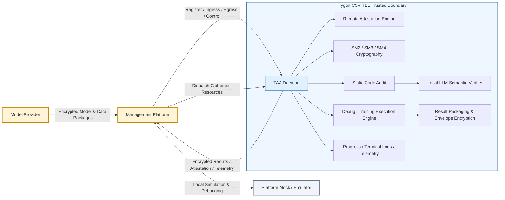

# Trusted Application Agent (TAA)

**Trusted Application Agent (TAA)** is a confidential computing execution framework designed to run inside **Hygon CSV (China Secure Virtualization) TEE (Trusted Execution Environment)**. 

TAA serves as a secure execution enclave for model training and computation workflows: it isolates proprietary model algorithms, evaluation datasets, training corpora, and computation artifacts within a hardware-enforced trusted boundary. By orchestrating hardware remote attestation, GM/T national cryptography (SM2/SM3/SM4), multi-tier code security audits, and cryptographic envelope packaging, TAA establishes an end-to-end trusted computing loop: **"Hardware-Bound Identity, Ciphertext Delivery, In-Enclave Execution, and Verified Result Return"**.

---

## Key Positioning

- **Target Audience**: Management Platforms, AI Model Providers, Data Providers, and Training Execution Clusters.
- **Core Objective**: Execute secure resource ingress, code auditing, confidential training/debugging, artifact egress, and hardware attestation inside TEE while guaranteeing complete confidentiality and IP protection for both model and data providers.
- **Security Primitives**: Hygon CSV Remote Attestation + SM2/SM3/SM4 Cryptographic Envelopes + Local Static Analysis & LLM-Assisted Code Auditing.
- **Role**: A production-ready, closed-loop **Confidential Computing Execution Framework**.

---

## Architectural Workflow

TAA coordinates the entire confidential computing lifecycle through the following sequence:



1. **Hardware-Enforced Attestation**: On boot, TAA generates an ephemeral SM2 keypair, injects the public key into the CSV hardware `USERDATA` slot (`X || Y`), and retrieves a hardware-signed attestation report via direct `/dev/csv-guest` ioctl (`pkg/csvattest`).
2. **Identity Registration & Binding**: TAA registers with the platform by submitting its SM2 public key, raw CSV attestation report, and certificate validation parameters, permanently tying the container workload to the genuine CSV hardware root of trust.
3. **Ciphertext Ingress**: The platform delivers encrypted resource packages via HTTP. TAA decrypts, unpacks, and validates the resources strictly inside the TEE memory and local disk sandbox.
4. **Pre-Execution Code Audit**: Prior to executing untrusted user code, TAA performs AST-level static security scanning and triggers local LLM (Ollama/Qwen) semantic verification to eliminate false positives and block malicious operations.
5. **Real-time Progress & Terminal Log Reporting**: During training execution, TAA monitors intermediate progress files and streams chunked, deduplicated terminal execution logs (`train.jsonl`) back to the platform.
6. **Task Interruption & Graceful Abortion**: TAA provides a dedicated stop interface (`/v1/taa/stopTraining`) that recursively terminates subprocess trees upon command.
7. **Encrypted Egress**: Training output artifacts are validated for sensitive data leakage, zipped, and encrypted with SM2/SM4 digital envelopes before export, ensuring zero plaintext leakage to host or platform.

---

## Repository Structure

```text
.
├── cmd/                              # Executable entry points (Thin Entrypoints)
│   ├── taa/                          # TAA Enclave daemon entry point (main.go)
│   └── platform-mock/                # Platform mock emulator CLI entry point (main.go)
├── internal/                         # Private internal application logic
│   ├── app/                          # Service bootstrapping & orchestration layer
│   │   ├── taa/                      # TAA daemon startup, registration & HTTP assembly
│   │   └── mock/                     # Platform mock server & embedded Web console
│   ├── controller/                   # HTTP routing, resource management, reporting & platform dispatch
│   │   ├── route.go                  # Route handlers, state machine, import/export/attestation APIs
│   │   ├── register.go               # Startup platform registration
│   │   ├── report.go                 # Execution completion reporting (reportRes)
│   │   ├── model_reporting.go        # Granular reporting: model import, code audit, progress, logs
│   │   └── platform_client.go        # Unified HTTP client for platform callbacks
│   ├── attestation/                  # CSV attestation report parsing & field validation
│   └── codeaudit/                    # Two-tier security audit: static AST rules + Ollama LLM verification
├── pkg/                              # Reusable public packages
│   ├── csvattest/                    # Pure-Go Hygon CSV guest ioctl driver (/dev/csv-guest)
│   ├── crypto/                       # SM2, SM3, SM4-GCM envelope encryption & key utilities
│   ├── logger/                       # Structured JSON & console logger
│   └── utils/                        # File system, archive, and network helpers
├── configs/                          # Deployment configuration templates
│   ├── taa-local.json                # Bare-metal local host development template
│   ├── taa-docker.json               # Local Docker container development template
│   ├── taa-debug.json                # Remote Kubernetes debug Pod template
│   └── taa-production.json           # Production Kubernetes Pod template (identity injected via env)
├── deploy/                           # Container deployment manifests & Dockerfile
│   └── manifest/docker/              # Base environment Dockerfiles & build assets
├── models/                           # Bundled offline models & runtimes (e.g., Ollama / Qwen)
├── docs/                             # Architecture specifications & API design documents
├── deploy.sh                         # Unified multi-mode deployment, lifecycle & packaging script
├── Makefile                          # Build, testing, and execution targets
└── go.mod                            # Go module definition (Go 1.26+)
```

---

## Core Security Architecture

### 1. Trusted Computing Boundary

TAA isolates all sensitive operations inside the CSV TEE boundary:

- Ephemeral SM2 key generation & storage in memory.
- Hardware remote attestation report generation and verification.
- Decryption of model code, evaluation weights, and sensitive training data.
- Code security scanning and local LLM semantic arbitration.
- Subprocess execution, standard I/O redirection, and intermediate monitoring.
- Result leakage inspection, archive packaging, and SM2/SM4 envelope re-encryption.

### 2. GM/T National Cryptographic Envelope

TAA strictly adopts Chinese National Standard Cryptography (GM/T):

```text
Plaintext Data  ──►  SM4-GCM Encryption  ──►  Ciphertext Payload
                            ▲
                 Random SM4 Data Key (128-bit)
                            │
                            ▼
                    SM2 Public Key Encryption
                            │
                            ▼
                       WrappedKey (129 Bytes)

Final Envelope Format:  [ WrappedKey (129B) ] || [ SM4-GCM Ciphertext ]
```

- **SM2**: Used for asymmetric identity authentication, key exchange, and envelope key encapsulation.
- **SM3**: Cryptographic hash function used for digest calculation, model checksums, and attestation binding.
- **SM4-GCM**: High-throughput authenticated symmetric encryption protecting datasets, model weights, and exported training results.

---

## API Reference

All TAA APIs are exposed over HTTP `POST`.

### 1. TAA → Platform (Callbacks & Reporting)

| Endpoint | Method | Description |
| :--- | :---: | :--- |
| `/v1/taa/register` | `POST` | Hardware attestation report & SM2 public key registration during bootstrap |
| `/v1/taa/reportModelImport` | `POST` | Reports model download/import status, error messages, and SM3/SHA256 checksum |
| `/v1/taa/reportAudit` | `POST` | Reports code security audit status, risk statistics (`high`/`medium`/`low`), and report URL |
| `/v1/taa/reportProgress` | `POST` | Periodically reports training progress percentage, message, and timestamp |
| `/v1/taa/modelLog` | `POST` | Streams incremental, deduplicated training terminal execution logs (`train.jsonl`) |
| `/v1/taa/reportRes` | `POST` | Asynchronously reports final training/debugging results packaged as a zip archive |

### 2. Platform → TAA (Business & Control)

| Endpoint | Method | Description |
| :--- | :---: | :--- |
| `/v1/taa/importModel` | `POST` | Ingresses model code archive, triggers decompression and two-tier security audit |
| `/v1/taa/import` | `POST` | Ingresses dataset/resource packages into sandbox directories |
| `/v1/taa/switch` | `POST` | Transitions lifecycle phases (`Phase 1`: Debug, `Phase 2`: Test, `Phase 3`: Train) |
| `/v1/taa/stopTraining` | `POST` | Forcibly interrupts the active training job and cleans up child process trees |
| `/v1/taa/export` | `POST` | Exports computation results (supports plaintext or SM2 envelope encryption) |
| `/v1/taa/getResourceInfo` | `POST` | Inspects metadata, file listings, and sizes of uploaded resource packages |

### 3. Observability & Diagnostics (Platform → TAA)

| Endpoint | Method | Description |
| :--- | :---: | :--- |
| `/v1/taa/health` | `POST` | Health & readiness probe (verifies memory state and attestation status) |
| `/v1/taa/status` | `POST` | Comprehensive diagnostics: active phase, tasks, audit findings, and key fingerprints |
| `/v1/taa/logs` | `POST` | Retrieves structured in-memory execution logs with level filtering |
| `/v1/taa/getAttestation` | `POST` | Generates a fresh CSV attestation report for on-demand verification |

---

## Runtime Configuration

TAA reads its configuration from `taa-config.json` located in its working directory.

### Configuration Fields

```json
{
  "addr": ":6001",
  "platformIP": "127.0.0.1:18080",
  "dockerID": "taa-env-slim-v2",
  "contract": "",
  "securityScan": true,
  "modelDir": "/root/taa/models",
  "resultCheck": true,
  "dataDir": "/root/taa/data",
  "resultDir": "/root/taa/results",
  "modelInputDir": "/opt/taa/input",
  "modelOutputDir": "/opt/taa/output/result",
  "modelLogDir": "/opt/taa/output/log",
  "modelProgressDir": "/opt/taa/output/progress",
  "keysDir": "/opt/taa/keys",
  "llm": {
    "enabled": true,
    "endpoint": "http://127.0.0.1:11434",
    "model": "qwen2.5-coder:3b",
    "policy": "assist",
    "failClosed": true,
    "dir": "/root/taa/ollama-qwen"
  }
}
```

| Field | Default | Description |
| :--- | :--- | :--- |
| `addr` | `:6001` | HTTP server listening address |
| `platformIP` | Env `PLATFORM_IP` | Platform IP and port (`host:port`); reads environment in production |
| `dockerID` | Env `DOCKER_ID` | Container / Pod identifier; reads environment in production |
| `contract` | Env `CONTRACT` | Contract identifier (reserved optional) |
| `securityScan` | `true` | Enables AST static security scan during model import |
| `modelDir` | `/root/taa/models` | Unpacked model code directory |
| `resultCheck` | `true` | Inspects exported files for unauthorized plaintext data leakage |
| `modelInputDir` | `/opt/taa/input` | Read-only input dataset directory mounted for model training |
| `modelOutputDir`| `/opt/taa/output/result` | Target output directory for model training checkpoints and artifacts |
| `modelLogDir` | `/opt/taa/output/log` | Intermediate terminal log directory monitored by log watcher |
| `modelProgressDir`| `/opt/taa/output/progress`| Intermediate progress directory (`progress.json`) monitored by watcher |
| `keysDir` | `/opt/taa/keys` | Sensitive cryptographic key storage (restricted with `0700` permissions) |
| `llm.enabled` | `true` | Enables local LLM semantic arbitration for code audit |
| `llm.endpoint`| `http://127.0.0.1:11434`| Local Ollama service endpoint |
| `llm.model` | `qwen2.5-coder:3b` | Target LLM model for code analysis |
| `llm.policy` | `assist` | LLM arbitration mode (`assist`: dual confirmation, `enforce`: strict blocking) |
| `llm.failClosed`| `true` | Fails code audit if the LLM inference service is unreachable |
| `llm.dir` | `/root/taa/ollama-qwen` | Local filesystem path containing offline Ollama package and model weights |

### Configuration Templates

- **`configs/taa-local.json`**: For bare-metal host development. Uses `.local/taa/...` relative/local directories.
- **`configs/taa-docker.json`**: For local Docker container testing. Uses standard `/root/taa/...` and `/opt/taa/...` container paths.
- **`configs/taa-debug.json`**: For remote Kubernetes debug Pods (`/root/taadebug`).
- **`configs/taa-production.json`**: For production Kubernetes Pods. Omits `platformIP`, `dockerID`, and `contract` so they are dynamically injected by the orchestration platform via environment variables.

---

## Deployment & Operation (`deploy.sh`)

`deploy.sh` provides unified, multi-mode lifecycle management and image packaging:

### 1. Three Mutually Exclusive Running Modes

```bash
./deploy.sh [local|docker|remote] [start|stop|save] [components...] [options...]
```

- **`local`**: Bare-metal local host mode. Runs platform-mock, TAA daemon, and Ollama directly as host background processes without Docker. Ideal for rapid local code iteration.
- **`docker`**: Local Docker container mode (replaces legacy `local-docker`). Runs TAA and Ollama inside a local Docker container (`taa-env-slim-v2`), while platform-mock runs on the host.
- **`remote`**: Remote Kubernetes mode (default when omitted). Deploys to a remote TEE Kubernetes Pod via SSH and `kubectl`.

### 2. Supported Actions

- **`start`** (default): Builds binaries, prepares configs/certs, and starts target services.
- **`stop`**: Gracefully stops target services in the chosen mode.
- **`save`**: **Exclusively valid in `docker` mode** (`./deploy.sh docker save`). Packages the base image archive (`deploy/taa-env-slim-v2.tar.gz`) with production configuration (`configs/taa-production.json`) and pre-bundled LLM weights, tags it with a date stamp, and exports a deployable image archive.

### 3. Component Selection

Specify one or more components: `platform-mock`, `taa`, `qwen`. If omitted:
- In `local` or `docker` mode: all three components are deployed.
- In `remote` production mode (`DEBUG=false`): defaults to `taa` + `qwen` (omits `platform-mock` to avoid port 18080 conflict with host production agents).

### 4. Common CLI Examples

```bash
# Docker Container Mode
./deploy.sh docker start                      # Start all components in local Docker
./deploy.sh docker start --model qwen3:8b     # Start with custom LLM audit model
./deploy.sh docker taa                        # Deploy/update only TAA inside Docker
./deploy.sh docker stop                       # Stop local Docker services
./deploy.sh docker save                       # Export production Docker image archive
./deploy.sh docker save --tag my-taa:v1 -o /tmp/taa.tar.gz

# Local Bare-Metal Mode
./deploy.sh local start                       # Start all components directly on host
./deploy.sh local taa                         # Start only TAA on host
./deploy.sh local stop                        # Stop all local host processes

# Remote Kubernetes Mode
./deploy.sh remote start                      # Deploy to remote Kubernetes Pod (or simply ./deploy.sh)
./deploy.sh remote taa                        # Update TAA in remote Pod
./deploy.sh remote stop                       # Stop remote services
```

---

## Local Platform Mock & Web Console

TAA includes a full-featured management platform emulator with an embedded Web GUI console:

- **Source Code**: `cmd/platform-mock/main.go`, `internal/app/mock/index.html`
- **Default Port**: `18080` (or `28080` when `DEBUG=true`)
- **Web Console**: `http://127.0.0.1:18080`

```bash
# Build standalone platform mock binary
make platform-mock-build

# Run in foreground
./bin/platform-mock -addr 0.0.0.0:18080 -taa-target http://127.0.0.1:6001

# Run in background via deploy.sh
./deploy.sh docker platform-mock
```

### Web Console Capabilities

1. **Node Registration**: Live display of TAA hardware attestation, verification status, and SM2 public keys.
2. **Model Ingress & Audit**: Interactive upload of model packages with instant audit results and severity breakdowns (`high`/`medium`/`low`).
3. **Interactive Progress Bar**: Live progress tracking driven by TAA `/v1/taa/reportProgress` callbacks.
4. **Streaming Terminal Logs**: Real-time log window displaying chunked stdout/stderr terminal logs received from TAA `/v1/taa/modelLog`.
5. **Job Interruption**: One-click "Stop Training" trigger calling `/v1/taa/stopTraining`.
6. **Result Verification**: Decrypt and inspect training outputs exported from TAA.

---

## Build & Development

### Prerequisites

- **Go**: Version 1.26 or newer (`GOTOOLCHAIN=local` supported).
- **Environment**: Linux x86_64 with Hygon CSV hardware support (for TEE attestation; non-TEE environments run in simulation mode with warning).
- **Docker**: Required for `docker` mode and `docker save`.

### Build Commands

```bash
# Build TAA enclave daemon
make taa

# Build platform mock emulator
make platform-mock-build

# Run all unit tests
go test ./...

# Format and vet code
gofmt -w .
go vet ./...
```

---

## Documentation

- **Architecture Design**: `docs/TAA设计文档.md`
- **API Specifications**: `docs/taa接口设计文档.md`
- **Model Provider Integration Guide**: `docs/TAA模型提供方开发与接口对接规范.md`

---

## License & Security Notices

TAA is designed for authorized, privacy-preserving computation and dual-use secure enclaves. All cryptographic algorithms follow GM/T national standards (SM2/SM3/SM4). Ensure proper key management and hardware attestation verification before running in production multi-tenant environments.
