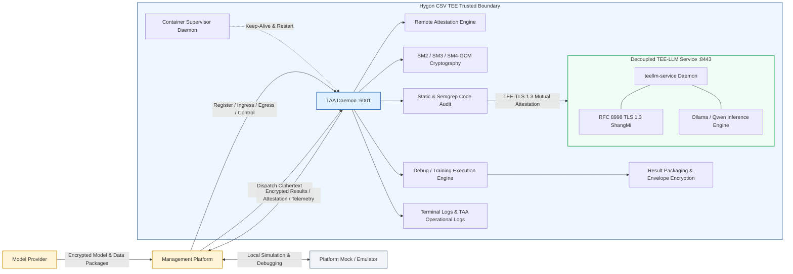

# Trusted Application Agent (TAA)

**Trusted Application Agent (TAA)** is a confidential computing execution framework designed to run inside **Hygon CSV (China Secure Virtualization) TEE (Trusted Execution Environment)**. 

TAA serves as a secure execution enclave for model training and computation workflows: it isolates proprietary model algorithms, evaluation datasets, training corpora, and computation artifacts within a hardware-enforced trusted boundary. By orchestrating hardware remote attestation, GM/T national cryptography (SM2/SM3/SM4), RFC 8998 TEE-TLS 1.3 ShangMi secure channels, two-tier defense-in-depth code security audits (Semgrep taint analysis & AST scope slicing + decoupled TEE-LLM semantic arbitration), and cryptographic digital envelopes, TAA establishes an end-to-end trusted computing loop: **"Hardware-Bound Identity, Ciphertext Delivery, In-Enclave Execution, and Verified Result Return"**.

---

## Key Positioning

- **Target Audience**: Management Platforms, AI Model Providers, Data Providers, and Training Execution Clusters.
- **Core Objective**: Execute secure resource ingress, deep code auditing, confidential training/debugging, artifact egress, and hardware attestation inside TEE while guaranteeing complete confidentiality and IP protection for both model and data providers.
- **Security Primitives**: Hygon CSV Remote Attestation + SM2/SM3/SM4-GCM Cryptographic Envelopes + RFC 8998 TEE-TLS 1.3 ShangMi Channels + Two-Tier Defense-in-Depth Code Audit (Semgrep Taint Analysis & AST Scope Slicing + Decoupled TEE-LLM Semantic Arbitration).
- **Role**: A production-ready, closed-loop **Confidential Computing Execution Framework**.

---

## Architectural Workflow

TAA coordinates the entire confidential computing lifecycle through the following sequence:


```mermaid
flowchart LR
    Platform[Management Platform]
    Provider[Model Provider]
    Mock[Platform Mock / Emulator]

    subgraph TEE[Hygon CSV TEE Trusted Boundary]
        TAA[TAA Daemon :6001]
        Attest[Remote Attestation Engine]
        Crypto[SM2 / SM3 / SM4-GCM Cryptography]
        Audit[Static & Semgrep Code Audit]
        Supervisor[Container Supervisor Daemon]
        Train[Debug / Training Execution Engine]
        Export[Result Packaging & Envelope Encryption]
        Logs[Terminal Logs & TAA Operational Logs]

        subgraph TEELLM[Decoupled TEE-LLM Service :8443]
            LLMServer[teellm-service Daemon]
            TEETLS[RFC 8998 TLS 1.3 ShangMi]
            Ollama[Ollama / Qwen Inference Engine]
            LLMServer --- TEETLS
            LLMServer --- Ollama
        end

        TAA --> Attest
        TAA --> Crypto
        TAA --> Audit
        Audit -->|TEE-TLS 1.3 Mutual Attestation| TEELLM
        TAA --> Train
        Train --> Export
        TAA --> Logs
        Supervisor -.->|Keep-Alive & Restart| TAA
    end

    Platform -->|Register / Ingress / Egress / Control| TAA
    Provider -->|Encrypted Model & Data Packages| Platform
    Platform -->|Dispatch Ciphertext Resources| TAA
    TAA -->|Encrypted Results / Attestation / Telemetry| Platform
    Platform <-->|Local Simulation & Debugging| Mock

    style TEE fill:#eef7ff,stroke:#4a78a8,stroke-width:1.5px
    style TAA fill:#dff1ff,stroke:#2b6cb0,stroke-width:1.5px
    style TEELLM fill:#f0fdf4,stroke:#16a34a,stroke-width:1.5px
    style Platform fill:#fff4d6,stroke:#c48a00,stroke-width:1.5px
    style Provider fill:#fff4d6,stroke:#c48a00,stroke-width:1.5px
    style Mock fill:#f1f5f9,stroke:#64748b,stroke-width:1.5px
```

1. **Hardware-Enforced Attestation**: On boot, TAA generates an ephemeral SM2 keypair, injects the public key into the CSV hardware `USERDATA` slot (`X || Y`), and retrieves a hardware-signed attestation report via direct `/dev/csv-guest` ioctl (`pkg/csvattest`).
2. **Identity Registration & Binding**: TAA registers with the platform by submitting its SM2 public key, raw CSV attestation report, and certificate validation parameters (`/v1/taa/register`), permanently tying the container workload to the genuine CSV hardware root of trust.
3. **Ciphertext Ingress**: The platform delivers encrypted resource packages via HTTP (`/v1/taa/import`, `/v1/taa/importModel`). TAA decrypts, unpacks, and validates the resources strictly inside the TEE memory and local disk sandbox.
4. **Two-Tier Pre-Execution Code Audit**: Prior to executing untrusted user code, TAA performs AST-level static security scanning and 13 canonical Semgrep taint analysis rules (covering command injection, SSRF, arbitrary file writes, and dynamic evaluation), followed by semantic verification against a decoupled local LLM (`teellm-service`) over RFC 8998 TEE-TLS 1.3 to eliminate false positives and block malicious operations.
5. **Real-time Progress & Dual-Log Telemetry**: During training execution, TAA monitors intermediate progress snapshots (`/v1/taa/reportProgress`), streams chunked deduplicated terminal execution logs (`/v1/taa/modelLog`), and actively reports internal operational logs (`/v1/taa/taaLog`).
6. **Task Interruption & Graceful Abortion**: TAA provides a dedicated stop interface (`/v1/taa/stopTraining`) that recursively terminates subprocess process trees upon command.
7. **Encrypted Egress**: Training output artifacts are inspected for sensitive data leakage, zipped, and encrypted with SM2/SM4-GCM digital envelopes before export, ensuring zero plaintext leakage to host or platform.

---

## Repository Structure

```text
.
├── cmd/                              # Executable entry points (Thin Entrypoints)
│   └── taa/                          # TAA Enclave daemon entry point (main.go)
├── internal/                         # Private internal application logic
│   ├── app/taa/                      # TAA daemon startup, registration & HTTP assembly
│   ├── controller/                   # HTTP routing, state machine, import/export/attestation APIs
│   ├── attestation/                  # CSV attestation report parsing & certificate chain validation
│   ├── codeaudit/                    # Two-tier security audit: Semgrep taint engine + TEE-LLM client
│   ├── coordinator/                  # Phase state machine and execution coordinator
│   ├── runtime/                      # Subprocess execution sandbox, process groups & output reader
│   ├── resource/                     # Resource package decompression, verification & file tree
│   ├── platform/                     # Unified HTTP client for platform callbacks
│   ├── config/                       # Configuration loader and validator
│   └── store/                        # In-memory and persistent state storage
├── pkg/                              # Reusable public packages
│   ├── csvattest/                    # Pure-Go Hygon CSV guest ioctl driver (/dev/csv-guest)
│   ├── crypto/                       # SM2, SM3, SM4-GCM envelope encryption & key utilities
│   ├── logger/                       # Structured JSON & console logger with monotonic sequence IDs
│   ├── filetree/                     # Directory tree scanner and ASCII formatting
│   ├── errors/                       # Unified error definitions and codes
│   └── utils/                        # File system, archive, and network helpers
├── teellm/                           # Decoupled TEE-LLM inference microservice (git submodule)
│   ├── cmd/teellm-service/           # Confidential inference daemon entry point
│   ├── configs/                      # TEE-LLM deployment configs (Docker & Production)
│   ├── deploy/                       # TEE-LLM container supervisor and start scripts
│   ├── deploy.sh                     # Standalone TEE-LLM deployment & model management script
│   └── teetls/                       # RFC 8998 TLS 1.3 ShangMi protocol library (nested submodule)
├── tools/                            # Auxiliary developer and platform tools
│   ├── platform-mock/                # Test management platform emulator & Web console
���   │   ├── cmd/platform-mock/        # CLI entry point (main.go)
│   │   └── internal/                 # Mock server logic, handlers, state store & UI assets
│   └── sdk/                          # TEE cryptographic SDK & CLI tools (teecrypto)
│       ├── cmd/teecrypto-cli/        # Command-line encryption/decryption tool
│       └── gui-tauri/                # Cross-platform desktop GUI application
├── api/                              # Standardized interface definitions
│   ├── openapi.yaml                  # OpenAPI 3.0.3 specification for all TAA endpoints
│   └── proto/                        # Protocol buffer schemas (e.g., CipherFlow v1)
├── configs/                          # Deployment configuration templates
│   ├── taa-docker.json               # Local Docker container development template
│   └── taa-production.json           # Production Kubernetes Pod template (identity injected via env)
├── deploy/                           # Container deployment manifests & supervisor scripts
│   ├── start.sh                      # TAA autostart supervisor daemon with keep-alive & manual mode
│   ├── certs/                        # Hygon CSV certificate chain (hrk.cert, hsk_cek.cert)
│   └── manifest/docker/              # Base environment Dockerfiles & build assets
├── models/                           # Bundled offline models & runtimes (e.g., Ollama / Qwen)
├── docs/                             # Architecture specifications & API design documents
├── deploy.sh                         # Unified multi-mode deployment, lifecycle & packaging script
├── go.work                           # Go workspace definition (orchestrating taa, teellm, teetls, sdk)
└── go.mod                            # Go module definition (Go 1.22+)
```

---

## Core Security Architecture

### 1. Trusted Computing Boundary

TAA isolates all sensitive operations inside the CSV TEE boundary:

- Ephemeral SM2 key generation & storage in memory.
- Hardware remote attestation report generation and verification via `/dev/csv-guest`.
- Decryption of model code, evaluation weights, and sensitive training data.
- Two-tier code security scanning: Semgrep taint analysis + AST scope slicing + local LLM semantic arbitration.
- Subprocess execution, standard I/O redirection, and intermediate monitoring.
- Result leakage inspection, archive packaging, and SM2/SM4-GCM envelope re-encryption.

### 2. GM/T National Cryptographic Envelope & RFC 8998 TEE-TLS 1.3

TAA strictly adopts Chinese National Standard Cryptography (GM/T) for all data at rest and data in transit:

```text
Plaintext Data  ──►  SM4-GCM Encryption  ──►  Ciphertext Payload
                            ▲
                 Random SM4 Data Key (128-bit)
                            │
                            ▼
                    SM2 Public Key Encryption
                            │
                            ▼
                       WrappedKey (129 Bytes)

Final Envelope Format:  [ WrappedKey (129B) ] || [ SM4-GCM Ciphertext ]
```

- **SM2**: Used for asymmetric identity authentication, key exchange, and digital envelope key encapsulation.
- **SM3**: Cryptographic hash function used for digest calculation, model checksums, and attestation binding.
- **SM4-GCM**: High-throughput authenticated symmetric encryption protecting datasets, model weights, and exported training results.
- **RFC 8998 TEE-TLS 1.3 ShangMi**: Mutual attestation and TLS 1.3 channel (`TLS_SM4_GCM_SM3`, cipher suite `0x00c6`) securing intra-TEE microservice communication between TAA and `teellm-service`. Enclave hardware attestation evidence is cryptographically bound into X.509 certificate extensions (OID `1.3.6.1.4.1.58270.1.1`).

### 3. Two-Tier Defense-in-Depth Code Security Audit

Untrusted model code undergoes rigorous two-tier verification before execution:

1. **Tier 1: Semgrep AST & Deep Taint Analysis**:
   - 13 canonical security rules covering Python, Go, and Shell scripts.
   - Detects OS command injection (`subprocess`, `os.system`), path traversal, arbitrary file writes, SSRF/unauthorized network egress, and dynamic code execution (`eval`, `exec`).
   - Extracts precise AST scope contexts and taint propagation trajectories.
2. **Tier 2: Decoupled TEE-LLM Semantic Arbitration**:
   - Forwards flagged AST contexts and taint evidence to the local `teellm-service` (Qwen2.5-Coder) over TEE-TLS 1.3.
   - LLM analyzes whether flagged snippets represent malicious intent or benign ML operations (e.g., standard PyTorch checkpoint saving).
   - Features circuit breaker protection, jittered exponential backoff retries, and strict fail-closed security gates.

---

## API Reference

All TAA APIs are exposed over HTTP `POST`. For comprehensive request/response schemas, refer to the OpenAPI 3.0.3 specification in `api/openapi.yaml`.

### 1. TAA → Platform (Callbacks & Reporting)

| Endpoint | Method | Description |
| :--- | :---: | :--- |
| `/v1/taa/register` | `POST` | Hardware attestation report & SM2 public key registration during bootstrap |
| `/v1/taa/reportModelImport` | `POST` | Reports model download/import status, error messages, and SM3/SHA256 checksum |
| `/v1/taa/reportAudit` | `POST` | Reports code security audit status, risk statistics (`high`/`medium`/`low`), and report URL |
| `/v1/taa/reportProgress` | `POST` | Periodically reports training progress percentage, message, and timestamp |
| `/v1/taa/modelLog` | `POST` | Streams incremental, deduplicated training terminal execution logs (`train.jsonl`) |
| `/v1/taa/taaLog` | `POST` | Streams incremental, deduplicated TAA internal operational logs with monotonic sequence IDs |
| `/v1/taa/reportRes` | `POST` | Asynchronously reports final training/debugging results packaged as a zip archive |

### 2. Platform → TAA (Business & Control)

| Endpoint | Method | Description |
| :--- | :---: | :--- |
| `/v1/taa/importModel` | `POST` | Ingresses model code archive, triggers decompression and two-tier security audit |
| `/v1/taa/import` | `POST` | Ingresses dataset/resource packages into sandbox directories |
| `/v1/taa/switch` | `POST` | Transitions lifecycle phases (`Phase 1`: Debug, `Phase 2`: Test, `Phase 3`: Train) |
| `/v1/taa/stopTraining` | `POST` | Forcibly interrupts the active training job and recursively cleans up child process trees |
| `/v1/taa/export` | `POST` | Exports computation results (supports plaintext or SM2/SM4 digital envelope encryption) |
| `/v1/taa/getResourceInfo` | `POST` | Inspects metadata, file listings, and sizes of uploaded resource packages |

### 3. Observability & Diagnostics (Platform → TAA)

| Endpoint | Method | Description |
| :--- | :---: | :--- |
| `/v1/taa/health` | `POST` | Health & readiness probe (verifies memory state and attestation status) |
| `/v1/taa/status` | `POST` | Comprehensive diagnostics: active phase, tasks, audit findings, and key fingerprints |
| `/v1/taa/getAttestation` | `POST` | Generates a fresh CSV attestation report for on-demand verification |

---

## Runtime Configuration

TAA reads its configuration from `taa-config.json` located in its working directory.

### Configuration Fields

```json
{
  "addr": ":6001",
  "platformIP": "127.0.0.1:18080",
  "dockerID": "taa-env-slim-v2",
  "contract": "",
  "securityScan": true,
  "modelDir": "/root/taa/models",
  "resultCheck": true,
  "maxFileBytes": 3221225472,
  "dataDir": "/root/taa/data",
  "resultDir": "/root/taa/results",
  "modelInputDir": "/opt/taa/input",
  "modelOutputDir": "/opt/taa/output/result",
  "modelLogDir": "/opt/taa/output/log",
  "modelProgressDir": "/opt/taa/output/progress",
  "keysDir": "/opt/taa/keys",
  "attestation": {
    "hrkCertPath": "/root/taa/certs/hrk.cert",
    "hskCekCertPath": "/root/taa/certs/hsk_cek.cert"
  },
  "llm": {
    "enabled": true,
    "transport": "teetls",
    "endpoint": "https://127.0.0.1:8443",
    "model": "qwen2.5-coder:3b",
    "policy": "assist",
    "failClosed": true,
    "insecureSkipVerify": false,
    "attestationMode": "strict"
  }
}
```

| Field | Default | Description |
| :--- | :--- | :--- |
| `addr` | `:6001` | HTTP server listening address |
| `platformIP` | Env `PLATFORM_IP` | Platform IP and port (`host:port`); dynamically injected via environment in production |
| `dockerID` | Env `DOCKER_ID` | Container / Pod identifier; dynamically injected via environment in production |
| `contract` | Env `CONTRACT` | Contract identifier (reserved optional) |
| `securityScan` | `true` | Enables Semgrep AST static security scan during model import |
| `modelDir` | `/root/taa/models` | Unpacked model code directory |
| `resultCheck` | `true` | Inspects exported files for unauthorized plaintext data leakage |
| `maxFileBytes` | `3221225472` (3 GB) | Maximum file size threshold for export leakage inspection before triggering size anomaly warning |
| `modelInputDir` | `/opt/taa/input` | Read-only input dataset directory mounted for model training |
| `modelOutputDir`| `/opt/taa/output/result` | Target output directory for model training checkpoints and artifacts |
| `modelLogDir` | `/opt/taa/output/log` | Intermediate terminal log directory monitored by log watcher (`modelLog`) |
| `modelProgressDir`| `/opt/taa/output/progress`| Intermediate progress directory (`progress.json`) monitored by progress watcher |
| `keysDir` | `/opt/taa/keys` | Sensitive cryptographic key storage (restricted with `0700` permissions) |
| `attestation.hrkCertPath` | `/root/taa/certs/hrk.cert` | Hygon Root Key (HRK) certificate path for CSV attestation verification |
| `attestation.hskCekCertPath` | `/root/taa/certs/hsk_cek.cert` | Hygon Sign Key (HSK) / Chip Endorsement Key (CEK) certificate path |
| `llm.enabled` | `true` | Enables local LLM semantic arbitration for code security audits |
| `llm.transport` | `teetls` | Transport protocol for TEE-LLM communication (`teetls` for RFC 8998 TLS 1.3 ShangMi, or `http`) |
| `llm.endpoint` | `https://127.0.0.1:8443` | Decoupled TEE-LLM service endpoint |
| `llm.model` | `qwen2.5-coder:3b` | Target LLM model for code analysis |
| `llm.policy` | `assist` | LLM arbitration mode (`assist`: dual confirmation, `enforce`: strict blocking) |
| `llm.failClosed` | `true` | Fails code audit if the LLM inference service is unreachable or encounters timeout |
| `llm.insecureSkipVerify` | `false` | Skips TLS CA certificate verification (set to `true` only for local Docker testing) |
| `llm.attestationMode` | `strict` | Hardware attestation verification policy for TEE-TLS (`strict` in production, `permissive` in local simulation) |

### Configuration Templates

- **`configs/taa-docker.json`**: For local Docker container testing. Uses standard `/root/taa/...` and `/opt/taa/...` container paths, with `attestationMode: "permissive"` and `insecureSkipVerify: true`.
- **`configs/taa-production.json`**: For production Kubernetes Pods. Omits `platformIP`, `dockerID`, and `contract` so they are dynamically injected by the orchestration platform via environment variables, and enforces `attestationMode: "strict"`.

---

## Deployment & Operation (`deploy.sh`)

`deploy.sh` provides unified, multi-mode lifecycle management and image packaging for TAA and platform-mock:

### 1. Two Mutually Exclusive Running Modes

```bash
./deploy.sh [docker|remote] [start|stop|save] [components...] [options...]
```

- **`docker`**: Local Docker container mode. Runs TAA inside a local Docker container (`taa-env-slim-v2`) managed by a supervisor daemon (`deploy/start.sh`), while platform-mock runs on the host.
- **`remote`**: Remote Kubernetes mode (default when omitted). Deploys to a remote TEE Kubernetes Pod via SSH and `kubectl`.

### 2. Supported Actions

- **`start`** (default): Builds binaries, prepares configs/certs, starts supervisor daemon, and launches target services.
- **`stop`**: Gracefully stops target services in the chosen mode.
- **`save`**: **Exclusively valid in `docker` mode** (`./deploy.sh docker save`). Packages the base image archive (`deploy/taa-env-slim-v2.tar.gz`) with production configuration (`configs/taa-production.json`) and pre-bundled LLM weights, tags it with a date stamp, and exports a deployable image archive.

### 3. Component Selection

Specify one or more components: `platform-mock`, `taa`. If omitted:
- In `docker` mode: defaults to deploying both `platform-mock` and `taa`.
- In `remote` mode: defaults to `taa` (omits `platform-mock` to avoid port 18080 conflict with host production agents).
- **Note on TEE-LLM / Qwen / Ollama**: The LLM inference service is decoupled and independently managed by the `teellm` submodule. To deploy TEE-LLM, run `(cd teellm && ./deploy.sh [docker|remote])`.

### 4. Container Autostart Supervisor (`deploy/start.sh`)

Inside Docker containers, TAA runs under the supervision of `deploy/start.sh` (deployed to `/root/taa/start.sh`):
- Automatically restarts `taa` upon unexpected exits (10s retry interval).
- Provides a manual debug override: `touch /root/taa/manual` pauses autostart; removing the file resumes supervisor management.
- Logs runtime supervisor events to `/root/taa/taa.log`.

### 5. Common CLI Examples

```bash
# Docker Container Mode
./deploy.sh docker start                      # Start TAA in container and platform-mock on host
./deploy.sh docker taa                        # Deploy/update only TAA inside Docker
./deploy.sh docker platform-mock              # Deploy/update only platform-mock on host
./deploy.sh docker stop                       # Stop local Docker services
./deploy.sh docker save                       # Export production Docker image archive
./deploy.sh docker save --tag my-taa:v1 -o /tmp/taa.tar.gz

# Remote Kubernetes Mode
./deploy.sh remote start                      # Deploy TAA to remote Kubernetes Pod (or simply ./deploy.sh)
./deploy.sh remote taa                        # Update TAA in remote Pod
./deploy.sh remote stop                       # Stop remote services

# Decoupled TEE-LLM Service
(cd teellm && ./deploy.sh docker start)       # Deploy TEE-LLM service in Docker
(cd teellm && ./deploy.sh remote start)       # Deploy TEE-LLM service in remote Kubernetes Pod
```

---

## Local Platform Mock & Web Console

TAA includes a full-featured management platform emulator with an embedded Web GUI console:

- **Source Code**: `tools/platform-mock/cmd/platform-mock/main.go`, `tools/platform-mock/internal/static/`
- **Default Port**: `18080`
- **Web Console**: `http://127.0.0.1:18080`

```bash
# Build standalone platform mock binary
go build -o bin/platform-mock ./tools/platform-mock/cmd/platform-mock

# Run in foreground
./bin/platform-mock -addr 0.0.0.0:18080 -taa-target http://127.0.0.1:6001

# Run in background via deploy.sh
./deploy.sh docker platform-mock
```

### Web Console Capabilities

1. **Lifecycle Pipeline Stepper**: Visual step progress bar across the entire pipeline (`Register` ➔ `Ingress` ➔ `Audit` ➔ `Switch` ➔ `Train` ➔ `Export`) with live auto-synchronization.
2. **Node Registration & Attestation**: Live display of TAA hardware attestation, certificate verification status, and SM2 public keys.
3. **Visual Audit Dashboard**: Interactive findings accordion featuring risk severity badges (`HIGH`/`MEDIUM`/`LOW`), AST code scope snippets, and taint trajectory details.
4. **Live Dual-Log Streaming**: Independent, real-time views for training terminal logs (`/v1/taa/modelLog`) and TAA operational logs (`/v1/taa/taaLog`), equipped with level filters, instant search, smart auto-scroll, and pause/resume.
5. **Payload Inspector Modal**: Tabbed inspection of inbound callback and outbound request JSON payloads.
6. **Global Stacked Toast Notifications**: Real-time micro-interactions and asynchronous alert feedback.
7. **Task Interruption**: One-click "Stop Training" trigger invoking `/v1/taa/stopTraining` to abort running jobs.
8. **Result Verification & Decryption**: In-browser SM2/SM4 digital envelope decryption and inspection of exported training outputs.

---

## Build & Development

### Prerequisites

- **Go**: Version 1.22 or newer (orchestrated via `go.work` multi-module workspace).
- **Environment**: Linux x86_64 with Hygon CSV hardware support (for genuine TEE attestation; non-TEE environments run in simulation mode with warning).
- **Docker**: Required for `docker` mode and `docker save`.

### Build Commands

```bash
# Build TAA enclave daemon
go build -o bin/taa ./cmd/taa

# Build platform mock emulator
go build -o bin/platform-mock ./tools/platform-mock/cmd/platform-mock

# Build decoupled TEE-LLM microservice
(cd teellm && go build -o bin/teellm-service ./cmd/teellm-service)

# Build TEE Crypto SDK CLI
(cd tools/sdk && go build -o bin/teecrypto-cli ./cmd/teecrypto-cli)

# Run all unit tests across the workspace
go test ./...

# Format and vet code
gofmt -w .
go vet ./...
```

---

## Documentation

- **Architecture Design**: `docs/TAA设计文档.md`
- **API Specifications (Markdown)**: `docs/taa接口设计文档.md`
- **OpenAPI 3.0.3 Specification**: `api/openapi.yaml`
- **Model Provider Integration Guide**: `docs/TAA模型提供方开发与接口对接规范.md`
- **Platform Mock Emulator**: `tools/platform-mock/README.md`
- **TEE-LLM Inference Service**: `teellm/README.md`
- **TEE Crypto SDK**: `tools/sdk/README.md`
- **State Persistence & Self-Healing**: `docs/TAA状态持久化与崩溃自愈设计文档.md`
- **Project Changelog**: `CHANGELOG.md`

---

## Changelog

For a full historical record of changes, see [CHANGELOG.md](CHANGELOG.md).

### Recent Iterations & Milestones

- **2026-09-19: Architecture Decoupling, Supervisor Integration & Advanced UI/UX**
  - **Container Supervisor**: Extracted container autostart daemon (`deploy/start.sh`) for TAA with retry backoff and manual debug override (`manual`).
  - **Platform-Mock UI/UX Overhaul**: Interactive pipeline stage stepper, visual audit dashboard with expandable findings accordion, live dual-log viewer with level filtering and instant search, and global stacked toast notification system.
  - **Microservice Decoupling**: Decoupled `teellm` into an independent repository and embedded as a recursive git submodule; isolated backend inference lifecycle from TAA core.
  - **Toolchain Organization**: Reorganized auxiliary tools into top-level `tools/` directory (`tools/platform-mock` and `tools/sdk`).
  - **CipherFlow Specification Alignment**: Enforced 3-tier output directory isolation (`/opt/taa/output/{result,log,progress}`) and aligned Python SDK contracts.

- **2026-09-18: Operational Telemetry & RFC 8998 TEE-TLS Decoupling**
  - **Active Operational Logging**: Implemented `/v1/taa/taaLog` proactive streaming with monotonic sequence IDs and ring-buffer deduplication.
  - **TEE-TLS Protocol Decoupling**: Extracted `teetls` into a dedicated repository supporting RFC 8998 TLS 1.3 ShangMi with Hygon CSV hardware attestation evidence X.509 extensions.
  - **Platform-Mock Modularization**: Decomposed mock platform into modular API handlers, separated config/state stores, and embedded static web assets via `embed.FS`.
  - **Semgrep Benchmark Suite**: Automated matrix evaluation for static vs. LLM vs. hybrid code security auditing.

- **2026-09-17: RFC 8998 ShangMi Channel & Semgrep Deep Taint Engine**
  - **Confidential TEE-TLS 1.3**: Implemented TLS 1.3 ShangMi cipher suites (`TLS_SM4_GCM_SM3`) with SM2 certificates cryptographically bound to Hygon CSV hardware attestation reports.
  - **Decoupled TEE-LLM Service**: Introduced standalone `teellm-service` over TEE-TLS 1.3 with circuit breakers, exponential jitter retries, and strict SSRF defenses.
  - **Semgrep Deep Semantic & Taint Engine**: Integrated 13 canonical AST and taint analysis rules across Python, Go, and Shell with fail-closed security gates.
  - **Dynamic Export Thresholds**: Supported configurable `maxFileBytes` (default 3 GB) for export leakage inspection.

- **2026-09-16: Certificate Self-Verification & Three-Track Benchmark**
  - **Dynamic Attestation Verification**: Integrated Hygon CSV certificate chain (HRK/HSK/CEK) self-verification and runtime dynamic configuration.
  - **Three-Track Audit Benchmark**: Developed orthogonal benchmark suite evaluating rule-only, pure-LLM, and hybrid audit tracks with bootstrap confidence intervals.

- **2026-09-15: Initial Core Framework Release**
  - Initial implementation of TAA daemon inside Hygon CSV TEE, ephemeral SM2 keypair generation, hardware attestation injection (`/dev/csv-guest`), and GM/T SM2/SM3/SM4-GCM digital envelope packaging.
  - Three-tier runtime output directory isolation (`/opt/taa/output/{result,log,progress}`).
  - Lifecycle phase state transitions (`Phase 1` Debug, `Phase 2` Test, `Phase 3` Train) and graceful process tree termination (`/v1/taa/stopTraining`).

---

## License & Security Notices

TAA is designed for authorized, privacy-preserving computation and dual-use secure enclaves. All cryptographic algorithms follow GM/T national standards (SM2/SM3/SM4). Ensure proper key management and hardware attestation verification before running in production multi-tenant environments.
