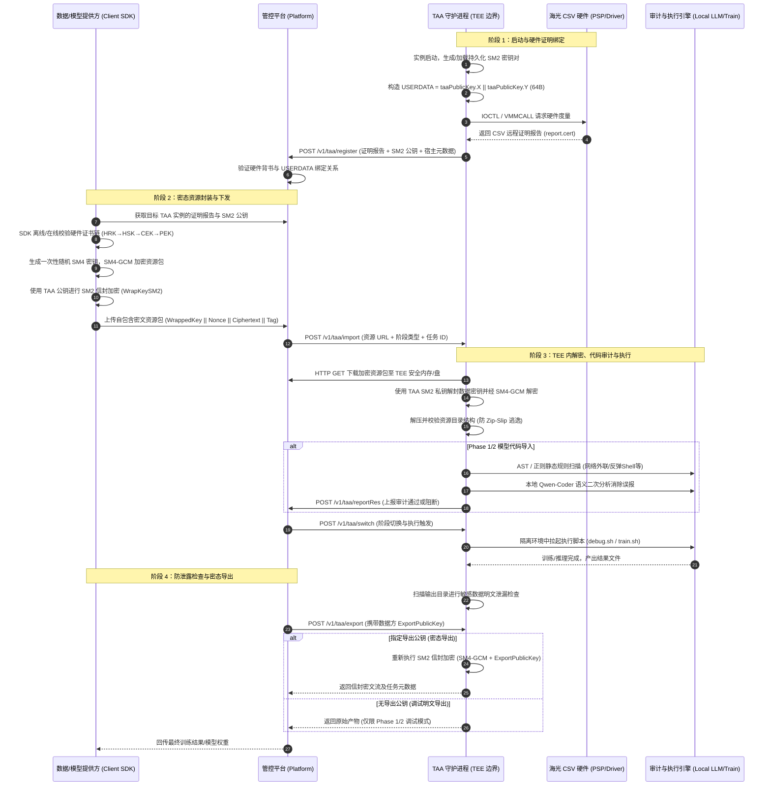

# TAA 设计文档

## 1. 项目概述

TAA（Trusted Application Attestation）是一个运行在 Hygon CSV（可信安全虚拟化）TEE 环境中的可信应用代理服务。它负责：

- 通过远程证明（Remote Attestation）向平台注册自身身份
- 接收平台下发的加密资源（模型代码、测试数据、训练数据）
- 在 TEE 安全环境中解密、审计、执行训练任务
- 将训练结果加密导出给平台

## 2. 系统架构

### 2.1 整体数据流与核心链路

TAA 构建了跨**数据/模型提供方（客户端 SDK）**、**管控平台**与 **Hygon CSV TEE 可信边界（TAA 实例）**的三方密态计算闭环。数据流转全过程保证“出端即加密、计算在密态、审计后执行、结果可回传”。

#### 2.1.1 核心数据流转时序图



#### 2.1.2 阶段流转架构拓扑

```text
 [数据/模型提供方 (teecrypto SDK)]
   │
   │ 1. 验证 TAA 证明报告 (HRK 根证书链)
   │ 2. 生成一次性 SM4 会话密钥加密资源包 (SM4-GCM)
   │ 3. 使用 TAA SM2 公钥封装会话密钥 (信封加密)
   ▼
┌────────────────────────────────────────────────────────┐
│ 管控平台 (Platform / Platform-Mock)                     │
│  - 维护容器生命周期与阶段切换 (Phase 1/2/3/4)            │
│  - 透传下发密态资源包 (URL)                             │
│  - 收集 TAA 注册身份、审计状态、心跳与训练结果          │
└───────────────────────┬────────────────────────────────┘
                        │
                        │ HTTP POST 调度指令 (import / switch / export)
                        ▼
┌────────────────────────────────────────────────────────┐
│ Hygon CSV TEE 可信硬件边界 (TAA Pod / Container)        │
│                                                        │
│  ┌──────────────────────────────────────────────────┐  │
│  │ 1. 身份与度量 (启动即证明)                       │  │
│  │    SM2 私钥 (/opt/taa/keys) ──► USERDATA (64B)   │  │
│  │    /dev/csv-guest IOCTL ────► Attestation Report │  │
│  └──────────────────────────────────────────────────┘  │
│                           │                            │
│                           ▼                            │
│  ┌──────────────────────────────────────────────────┐  │
│  │ 2. 密态导入与解密                                │  │
│  │    下载密文包 ──► SM2 私钥解封 SM4 密钥 ──►      │  │
│  │    SM4-GCM 解密 ──► 解包落盘 (/opt/taa/input)    │  │
│  └──────────────────────────────────────────────────┘  │
│                           │                            │
│                           ▼                            │
│  ┌──────────────────────────────────────────────────┐  │
│  │ 3. 深度代码安全审计                              │  │
│  │    AST/正则静态扫描 ──► 检出可疑高危特征         │  │
│  │    本地轻量大模型 (Ollama Qwen-Coder) 语义研判   │  │
│  │    阻断恶意逃逸 / 排除常规误报                   │  │
│  └──────────────────────────────────────────────────┘  │
│                           │                            │
│                           ▼                            │
│  ┌──────────────────────────────────────────────────┐  │
│  │ 4. 隔离执行与结果防泄露检查                      │  │
│  │    运行模型代码 (debug.sh / train.sh)            │  │
│  │    输出目录敏感明文排查 (ResultCheck)            │  │
│  └──────────────────────────────────────────────────┘  │
│                           │                            │
│                           ▼                            │
│  ┌──────────────────────────────────────────────────┐  │
│  │ 5. 结果重加密与导出                              │  │
│  │    读取 ExportPublicKey ──► SM2+SM4 信封重加密   │  │
│  │    HTTP Response 返回密文流给平台                │  │
│  └──────────────────────────────────────────────────┘  │
└────────────────────────────────────────────────────────┘
```

#### 2.1.3 核心数据流控制点矩阵

| 流转步骤 | 发起方 → 接收方 | 传输格式 / 算法 | 安全保护与控制目标 |
|---------|----------------|----------------|-------------------|
| **身份注册** | TAA → 管控平台 | Base64(CSV 报告) + SM2 公钥 | **启动即证明**：通过海光硬件 PSP 签名与 `USERDATA` 绑定，防止伪造容器身份与公钥劫持 |
| **客户端验签** | SDK 内部验证 | SM2 验签 + 证书链 (HRK→PEK) | **离线背书**：客户端独立校验 TAA 是否真实运行在合法 CSV TEE 环境中 |
| **资源封装** | 客户端 → 平台 | SM2 信封 + SM4-GCM 密文 | **出端即加密**：平台侧全程无法窥探模型源码与敏感原始数据 |
| **资源导入** | 平台 → TAA | HTTP 下发密文包 URL | **按需解密**：TAA 在可信内存内解封一次性 SM4 密钥并还原文件 |
| **代码审计** | TAA 内部流转 | Python AST 规则 + 本地 LLM 语义分析 | **审计后执行**：防止反弹 Shell、外联通信、数据外发等恶意行为 |
| **训练执行** | TAA 内部流转 | 隔离沙箱 /opt/taa/ | **密态计算**：模型与数据在 TEE 物理内存加密保障下执行计算 |
| **防泄露检测** | TAA 内部流转 | 熵值与特征扫描 | **出口设卡**：防止恶意代码将原始输入数据明文打包至模型输出权重中 |
| **结果导出** | TAA → 平台 → 提供方 | SM2 信封 (ExportPublicKey) | **密态回传**：计算结果经使用方指定公钥重新加密，平台仅作为密文管道 |

### 2.2 核心组件

| 组件 | 位置 | 职责 |
|------|------|------|
| TAA 主服务入口 | `cmd/taa/main.go` | 极简入口，参数解析与系统信号监听 |
| TAA 启动编排 | `internal/app/taa/` | 启动生命周期编排、密钥生成、注册、HTTP 服务初始化 |
| 平台模拟器入口 | `cmd/platform-mock/main.go` | 平台模拟器可执行入口 |
| 平台模拟器核心 | `internal/app/mock/` | 模拟器 HTTP 服务、反向代理与嵌入控制台 |
| 控制器 | `internal/controller/` | HTTP 路由、导入/导出/审计/阶段切换逻辑 |
| 远程证明 | `internal/attestation/` + `attestation/` | 调用 CSV 硬件生成远程证明报告 |
| 安全审计 | `internal/codeaudit/` | Python 代码静态扫描 + LLM 语义验证 |
| 加密工具 | `crypto/` | SM2 信封加密/解密，SM4-GCM |
| Ollama/Qwen | `ollama-qwen2.5-coder-0.5b/` | 本地 LLM 推理，用于代码审计的语义验证 |

## 3. 启动流程

```
┌─────────────────────────────────────────────────────────────────────┐
│              TAA 启动 (cmd/taa -> internal/app/taa)                 │
├───────────────────────────���─────────────────────────────────────────┤
│                                                                     │
│  1. 解析启动参数 (-debug, -addr, -security-scan 等)                  │
│  2. 生成 SM2 密钥对 (taaKeyPair)                                    │
│  3. 计算 USERDATA = SM3(publicKey + dockerId + platformIP + timestamp)│
│  4. 调用 attestation helper 生成远程证明报告 (report.cert)             │
│     └─ ATTESTATION_USERDATA 环境变量传入自定义 userdata                │
│  5. POST /v1/taa/register → 平台注册                                 │
│     └─ 携带: dockerId, attestation(base64), taaPublicKey,            │
│              attestationValues(JSON), timestamp, verifiedPass        │
│  6. 初始化 TAAState，启动 HTTP 服务 (默认 :6001)                      │
│                                                                     │
└─────────────────────────────────────────────────────────────────────┘
```

### 3.1 启动参数

| 参数 | 环境变量 | 默认值 | 说明 |
|------|---------|--------|------|
| `-debug` | — | `false` | 调试模式：跳过训练，导出原始产物 |
| `-addr` | — | `:6001` | HTTP 监听地址 |
| `-security-scan` | `SECURITY_SCAN` | `true` | 启用代码安全扫描 |
| `-result-check` | `RESULT_CHECK` | `true` | 启用导出结果泄露检查 |
| `-security-llm-verify` | `SECURITY_LLM_VERIFY` | `true` | 启用 LLM 语义验证 |
| `-security-llm-endpoint` | `SECURITY_LLM_ENDPOINT` | `http://127.0.0.1:11434` | Ollama 端点 |
| `-security-llm-model` | `SECURITY_LLM_MODEL` | `qwen2.5-coder:0.5b` | LLM 模型名 |
| `-model-dir` | `MODEL_DIR` | `/opt/taa/models` | 模型代码目录 |
| `-data-dir` | `DATA_DIR` | `/opt/taa/data` | 数据目录 |
| `-result-dir` | `RESULT_DIR` | `/opt/taa/results` | 结果目录 |

## 4. API 接口

### 4.1 接口路由

| 接口 | 方法 | 说明 |
|------|------|------|
| `/v1/taa/switch` | POST | 切换阶段 (1→2→3) |
| `/v1/taa/import` | POST | 导入资源（模型/测试数据/训练数据） |
| `/v1/taa/export` | POST | 导出结果 |
| `/v1/taa/getAttestation` | POST | 重新获取远程证明报告 |
| `/v1/taa/reportRes` | POST | 平台向 TAA 上报结果状态 |
| `/v1/taa/health` | GET | 健康检查 |
| `/v1/taa/logs` | POST | 查询日志 |
| `/v1/taa/status` | GET | 查询状态 |

### 4.2 公共返回格式

```json
{
  "msg": "success",
  "result": { ... },
  "error": 0
}
```

## 5. 阶段流程

### 5.1 阶段切换

```
Phase 1 (调试)     Phase 2 (测试)     Phase 3 (正式训练)
┌──────────┐      ┌──────────┐      ┌──────────────┐
│ type=1   │  →   │ type=2   │  →   │ type=3       │
│ 模型+代码 │      │ 测试数据  │      │ 训练数据      │
│ debug.sh │      │ train.sh │      │ train.sh     │
│ +审计     │      │ +审计    │      │ 无审计        │
└──────────┘      └──────────┘      └──────────────┘
```

### 5.2 导入流程 (`/v1/taa/import`)

```
平台发送 import 请求 (resourceUrl, type, taskId, requestId)
                    │
                    ▼
          ┌─── 下载密文文件 ───┐
          │   HTTP GET URL     │
          │   → /tmp/taa-*     │
          └────────┬───────────┘
                   ▼
          ┌─── 解密 ───────────────────────────────────┐
          │  拆分: WrappedKey || SM4-GCM 密文           │
          │  SM2 私钥解包 → SM4 会话密钥 (16B)          │
          │  SM4-GCM 解密 → 明文归档包                   │
          └────────┬───────────────────────────────────┘
                   ▼
          ┌─── 解压 ───────────────────────────────────┐
          │  自动检测格式: tar.gz / zip / tar            │
          │  type=1 → ModelDir  (/opt/taa/models)      │
          │  type=2,3 → DataDir (/opt/taa/data)        │
          │  .sh 文件自动 chmod +x                      │
          └────────┬───────────────────────────────────┘
                   ▼
         ┌─────────────────────────┐
         │  DebugMode == true ?    │
         └────┬─────────────┬─────┘
           YES│             │NO
              ▼             ▼
    ┌─────────────┐   ┌────────────────────────────────────┐
    │  调试模式     │   │           生产模式                   │
    ├─────────────┤   ├────────────────────────────────────┤
    │             │   │                                    │
    │ 保存调试产物  │   │  Phase 1 (type=1):                 │
    │ resultDir/  │   │    执行 debug.sh                    │
    │  debug/     │   │    代码安全审计                      │
    │  <taskId>/  │   │    生成报告 → 上报平台               │
    │  input.bin  │   │                                    │
    │  manifest   │   │  Phase 2 (type=2):                 │
    │             │   │    执行 train.sh                    │
    │ 生成模板报告  │   │    代码安全审计                      │
    │ debug_mode  │   │    生成报告 → 上报平台               │
    │  = true     │   │                                    │
    │             │   │  Phase 3 (type=3):                 │
    │ 上报平台     │   │    执行 train.sh                    │
    │ code=0      │   │    无审计                           │
    │             │   │    生成报告 → 上报平台               │
    └─────────────┘   └────────────────────────────────────┘
```

### 5.3 导出流程 (`/v1/taa/export`)

```
    平台发送 export 请求 (taskId, publicKey?)
                    │
                    ▼
          ┌─────────────────────┐
          │  DebugMode == true ? │
          └────┬──────────┬─────┘
            YES│          │NO
               ▼          ▼
    ┌──────────────┐  ┌──────────────────────────────┐
    │   调试模式    │  │        生产模式                │
    ├──────────────┤  ├──────────────────────────────┤
    │              │  │                              │
    │ 读取调试产物   │  │ 读取 result.bin              │
    │ debug/<tid>/ │  │                              │
    │ input.bin    │  │ 无 publicKey → 明文导出       │
    │              │  │ 有 publicKey → SM2 信封加密   │
    │ Phase 1/2:   │  │                              │
    │  无key→明文   │  └──────────────────────────────┘
    │  有key→加密   │
    │              │
    │ Phase 3:     │
    │  无key→400   │
    │  有key→加密   │
    └──────────────┘
```

### 5.4 上报流程 (TAA → 平台)

```
TAA 内部                           平台
────────                          ────

reportTrainingAsync()
     │
     ├─ POST /v1/taa/reportRes          (训练/调试结果报告)
     │
     └─ POST /v1/taa/reportResourceRes  (资源下载结果通知)
```

## 6. 代码安全审计

### 6.1 审计架构

```
    scanner.ScanDir(ModelDir)
            │
            ▼
    ┌─── 遍历 Python 文件 ───┐
    │  匹配 rules.go 中的规则  │
    │  - 网络外联 (NET_*)     │
    │  - 文件读写 (FILE_*)    │
    │  - 系统调用 (SYS_*)     │
    │  - 动态执行 (DYN_*)     │
    └────────┬───────────────┘
             ▼
      []Finding (可疑项)
             │
             ▼
    verifier.VerifyFindings()
             │
             ▼
    ┌─── LLM 语义验证 ───────┐
    │  llm.Client → Ollama   │
    │  http://127.0.0.1:11434│
    │  模型: qwen2.5-coder   │
    │                        │
    │  对每个 Finding 判断:    │
    │  - true_positive (确认) │
    │  - false_positive (误报)│
    │  - uncertain (不确定)   │
    └────────┬───────────────┘
             ▼
      AuditReport
      (passed/failed, risk_level, findings[])
```

### 6.2 源码文件

| 文件 | 行数 | 职责 |
|------|------|------|
| `internal/security/audit.go` | 434 | 审计入口，协调扫描+LLM验证，生成 `AuditReport` |
| `internal/security/scanner.go` | 314 | 静态扫描引擎，遍历 Python 文件匹配安全规则 |
| `internal/security/rules.go` | 227 | 安全规则定义，`Finding` 类型和严重级别 |
| `internal/security/llm.go` | 244 | Ollama/Qwen 客户端 |
| `internal/security/verifier.go` | 297 | LLM 语义验证，过滤误报 |
| `internal/security/result_checker.go` | 208 | 导出结果明文泄露检测 |

## 7. 远程证明

### 7.1 证明流程

1. TAA 启动时调用 `attestation/get-attestation` helper
2. Helper 通过 CSV 硬件（vmmcall 或 ioctl）获取远程证明报告
3. 报告包含 USERDATA（SM3 哈希）、MNONCE、DIGEST、CHIP_ID
4. 注册时报告以 Base64 编码发送给平台
5. `/v1/taa/getAttestation` 可重新生成报告（复用启动时的 USERDATA）

### 7.2 USERDATA 构成

```
USERDATA = SM3(taaPublicKey || dockerId || platformIP || timestamp)
```

- 64 字节（SM3 输出 32 字节，重复填充到 64 字节）
- 通过 `ATTESTATION_USERDATA` 环境变量传入 helper
- 在 `/v1/taa/getAttestation` 返回时，`userdata` 会转换为 PEM 格式的 SM2 公钥字符串
- 绑定 TAA 公钥、容器、平台与 TEE 硬件

### 7.3 attestationValues 字段

```json
{
  "userdata": "-----BEGIN PUBLIC KEY-----\n...\n-----END PUBLIC KEY-----",
  "mnonce": "dc4f8eb0...",
  "digest": "afb78b2e...",
  "chipId": "..."
}
```

## 8. 调试模式

### 8.1 启用方式

```sh
# 启动参数
./taa -debug -addr :6001

# 部署脚本
TAA_DEBUG_MODE=true ./deploy.sh taa
```

### 8.2 行为差异

| 行为 | 生产模式 | 调试模式 |
|------|---------|---------|
| 解密/解压 | ✅ 执行 | ✅ 执行 |
| debug.sh / train.sh | ✅ 执行 | ❌ 跳过 |
| 代码安全审计 | ✅ 执行 | ❌ 跳过 |
| 结果报告 | 真实训练报告 | 模板报告 (`debug_mode: true`) |
| 调试产物 | 无 | `resultDir/debug/<taskId>/input.bin` + `manifest.json` |
| 导出 Phase 1/2 无 key | result.bin 明文 | 原始输入包明文 |
| 导出 Phase 1/2 有 key | result.bin 加密 | 原始输入包加密 |
| 导出 Phase 3 无 key | result.bin 明文 | 400 错误 |
| 导出 Phase 3 有 key | result.bin 加密 | 原始输入包加密 |

## 9. 加密方案

### 9.1 SM2 信封加密

```
明文 → AES-256-GCM 加密 → 密文
              ↑
        随机 AES 数据密钥
              │
              └→ SM2 公钥加密 → WrappedKey (129 bytes)

输出格式: WrappedKey(129B) || Ciphertext(可变长)
```

### 9.2 密钥关系

- **TAA SM2 密钥对**：启动时随机生成，公钥注册到平台
- **AES 数据密钥**：每次加密随机生成，用 TAA SM2 公钥包装
- **平台 SM2 密钥对**：导出时由平台提供公钥，TAA 用于加密结果

## 10. 部署

### 10.1 部署脚本

```sh
# 全部部署
./deploy.sh

# 单独部署
./deploy.sh platform-mock   # 平台模拟器
./deploy.sh taa              # TAA 服务
./deploy.sh qwen             # Ollama/Qwen LLM
```

### 10.2 部署流程

```
本地构建 → scp 到远程宿主机 → kubectl cp 到容器 → 容器内启动
```

### 10.3 容器内目录结构

```
/taatest/
├── taa                          TAA 二进制
├── attestation.report           远程证明报告
├── attestation/
│   └── get-attestation          证明 helper
├── hrk.cert                     HRK 根证书
├── hsk_cek.cert                 HSK/CEK 证书
└── ollama-qwen2.5-coder-0.5b/  Ollama 离线包
    ├── ollama                   Ollama 二进制
    ├── start-ollama.sh          启动脚本
    ├── models/                  模型文件
    └── lib/                     运行时库
```

## 11. 项目目录结构

```
tee/
├── cmd/
│   ├── taa/                     TAA 主服务可执行入口
│   │   └── main.go
│   └── platform-mock/           平台模拟器可执行入口
│       └── main.go
├── Makefile                     构建命令
├── deploy.sh                    部署脚本
├── go.mod                       Go 模块定义
├── internal/
│   ├── app/                     应用启动编排层
│   │   ├── taa/                 TAA 启动编排与服务初始化
│   │   │   ├── app.go
│   │   │   └── server.go
│   │   └── mock/                平台模拟器服务与嵌入控制台
│   │       ├── server.go
│   │       └── index.html
│   ├── controller/              HTTP 路由和控制器
│   │   ├── route.go             路由注册、TAAState、handler
│   │   ├── import_processing.go 导入流程（解密、解压、训练）
│   │   ├── debug_mode.go        调试模式辅助函数
│   │   ├── report.go            上报平台逻辑
│   │   ├── register.go          注册逻辑
│   │   ├── platform_client.go   平台 HTTP 客户端
│   │   └── log_store.go         结构化日志存储
│   ├── attestation/             远程证明
│   │   ├── generate.go          调用 helper 生成报告
│   │   └── report.go            报告字段提取
│   ├── codeaudit/               代码安全审计
│   │   ├── audit.go             审计入口
│   │   ├── scanner.go           静态扫描引擎
│   │   ├── rules.go             安全规则定义
│   │   ├── llm.go               Ollama LLM 客户端
│   │   ├── verifier.go          LLM 语义验证
│   │   └── result_checker.go    导出结果泄露检测
│   ├── crypto/                  国密加解密与证书/密钥工具
│   ├── sm2/                     SM2 国密椭圆曲线实现
│   └── sm3/                     SM3 国密哈希算法实现
├── attestation/                 远程证明 C 工具链
│   ├── csv_c/                   非 SDK 的 C 工具
│   │   ├── Makefile             C 工具链构建脚本
│   │   ├── csv_status.h         共享 ABI 头文件
│   │   ├── calc_vm_digest.c     VM 测量值计算
│   │   ├── csv-guest.c         内核驱动
│   │   ├── dcu_attestation_demo.c  DCU 证明示例
│   │   ├── ioctl_get_attestation.c  ioctl 模式 helper
│   │   ├── ioctl_get_key.c      ioctl sealing-key helper
│   │   ├── verify_attestation.c  证明验证工具
│   │   ├── vmmcall_get_attestation.c  vmmcall 模式 helper
│   │   └── vmmcall_get_key.c    vmmcall sealing-key helper
│   └── csv_sdk/                 CSV SDK (C)
├── models/                      模型项目
│   ├── LogisticRegression/      逻辑回归模型
│   ├── TEE-test/                MNIST/CIFAR-10 测试
│   └── Retina-DKD/              视网膜疾病模型
├── ollama-qwen2.5-coder-0.5b/  Ollama 离线包
└── docs/                        文档
    ├── taa接口设计文档.md
    └── TAA设计文档.md            (本文件)
```
